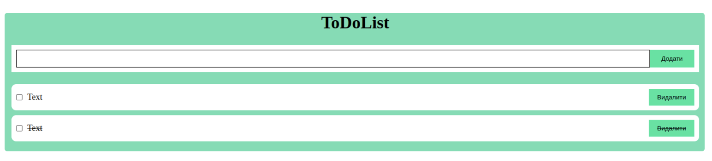

# HW15.1. 

## TODO з WebStorage

Доробити TODO лист, в якому буде можливість:

* Додати завдання
* Видалити завдання
* Відзначити як виконану
* Усі дані повинні зберегтися після перезавантаження сторінки.

Приклад:

Додатковы матерыали:

[HTML file](index.html)

[CSS file](main.css)