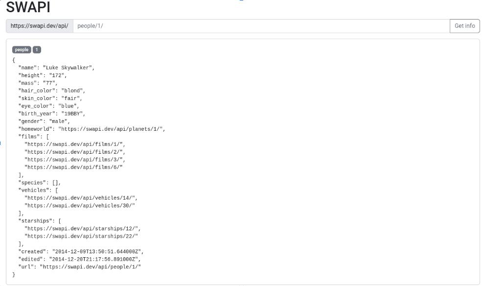

# HW24.1

## Cтворення АПІ для TODO списку

Сгенерувати свій перший реакт-додаток. Зробити інтерфейс для SWAPI. Увага, тільки інтерфейс, без логіки запитів та подій.

* Використати bootstrap через CDN
* За потреби свого набору стилів, додати їх через CSS файл

Приклад резульату

[SWAPI API](https://swapi.dev/)
