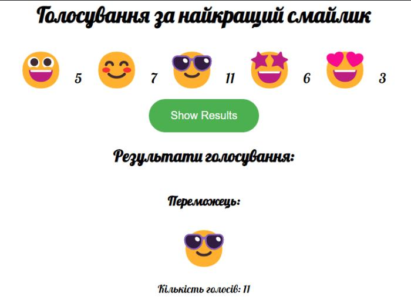

# HW25.1. 

## Голосування за смайлик (class component)

На сторінці відображається список смайликів та лічильник кліків по кожному.

Нижче є кнопка “Show Results” яка виводить смайл, що переміг, на підставі кількості голосів.
Дані голосування повинні зберігатися у localStorage
Повинна бути кнопка "Очистити результати". Яка буде видаляти

#### [Приклад](https://drive.google.com/file/d/1dCOrQzxow-IcgyUveu9_jcqxOasUz6lw/view?usp=drivesdk)
