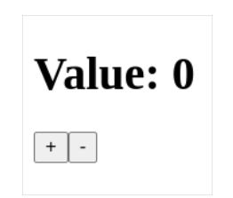
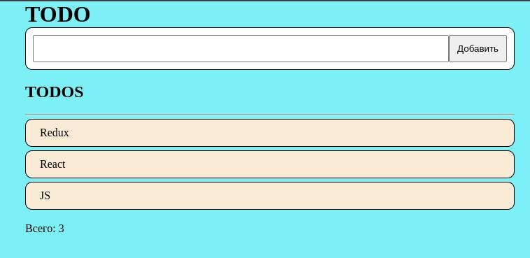

# HW29.1. 

## Counter з react та redux

З використанням React та Redux, реалізувати додаток коунтер. Після натискання на "+" збільшуємо його значення, після натискання на "-" зменшуємо.

Приклад інтерфейсу: [посилання](https://drive.google.com/file/d/1arlh0vP6MhnN1q0Lo55ZjdSNKciO56GF/view?usp=drivesdk)

# HW29.2.

## TODO list з redux

Реалізувати окремий TODO додаток, з використанням Redux. У додатку має бути лише форма додавання. Без редагування, видалення та позначки як виконане. У футері програми вивести загальну кількість елементів.

Приклад інтерфейсу: [посилання](https://drive.google.com/file/d/148pccGkJlGJkLoVQ0cmW10eYB_c430Vh/view)

