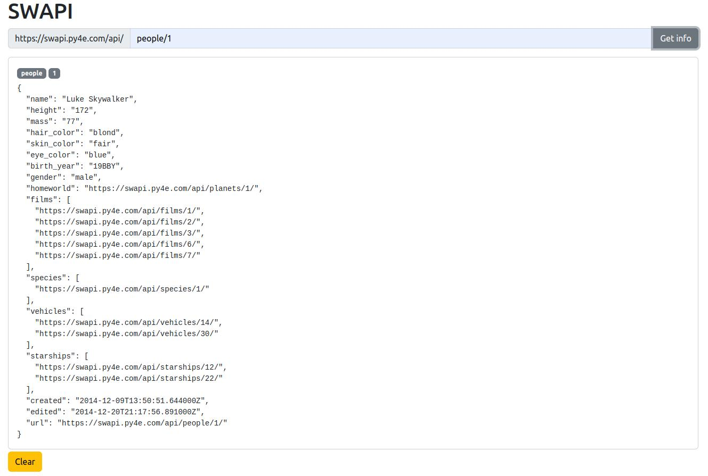

# HW 30.1

## Swapi

* Зробити додаток Swapi з використанням [redux-thunk](https://github.com/reduxjs/redux-thunk). 
* У футер додати кнопку, яка очистить данні TODO.
    
Приклад інтерфейсу: [посилання](https://drive.google.com/file/d/1G0VNqYbzX--F3Gz3V5pFFHII8xEX_9K6/view?usp=drivesdk)

