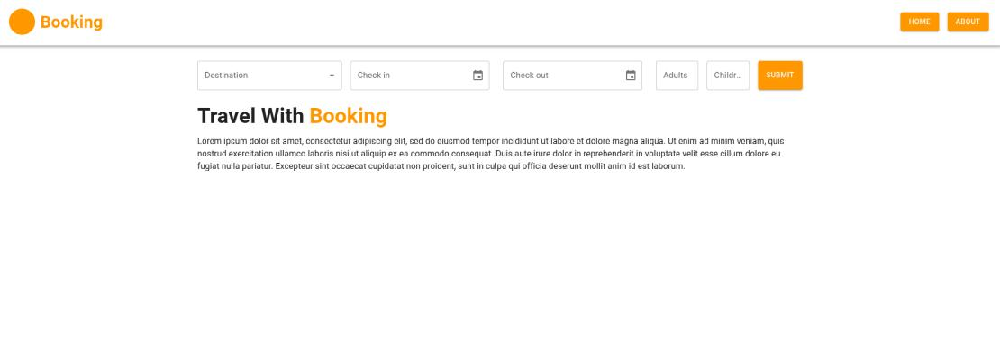
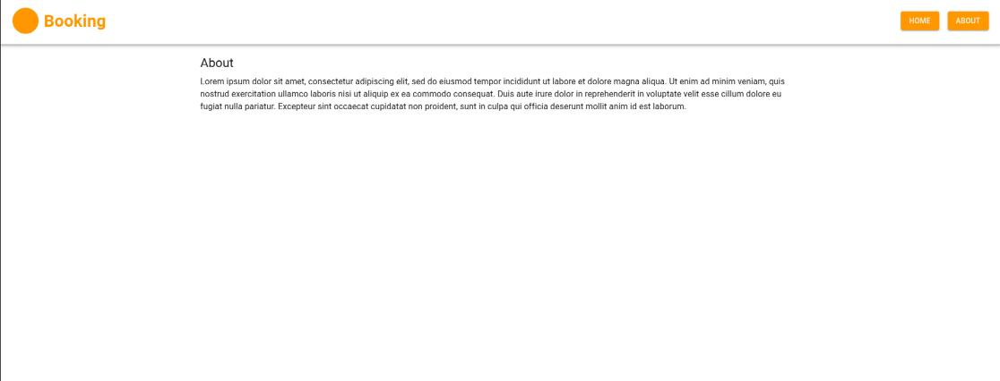
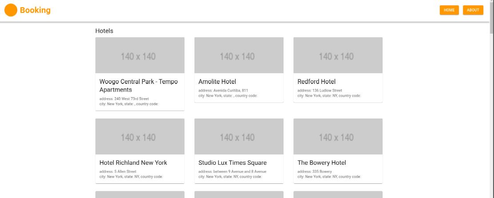

# HW34.1

## Bookinng

З використанням стека: Create React App, React-router, React-final-form, MUI, Axios, Redux, Redux-first-history, Redux-saga, ENV, Eslint, Json-server.

Самостійно зробити Booking додаток (можна підглядати з прикладу з уроку).

Додаток повинен складатися як мінімум із 3х частин:

* "Main" сторінка

* "About"

* "Hotels"

У полі"Destination" встановити список даних від сервера (дані прикріплено у файлі db.json).

Після заповнення даних форми (можна додати валідацію на обов'язкові поля) та натискання кнопки "Send". Потрібно надіслати запит на Json-server, за отриманням списку готелів. Дані форми надіслати в запит через платуload. І після успішної відповіді, зробити редирект на сторінку hotels. Де вже потрібно відобразити всі готелі.